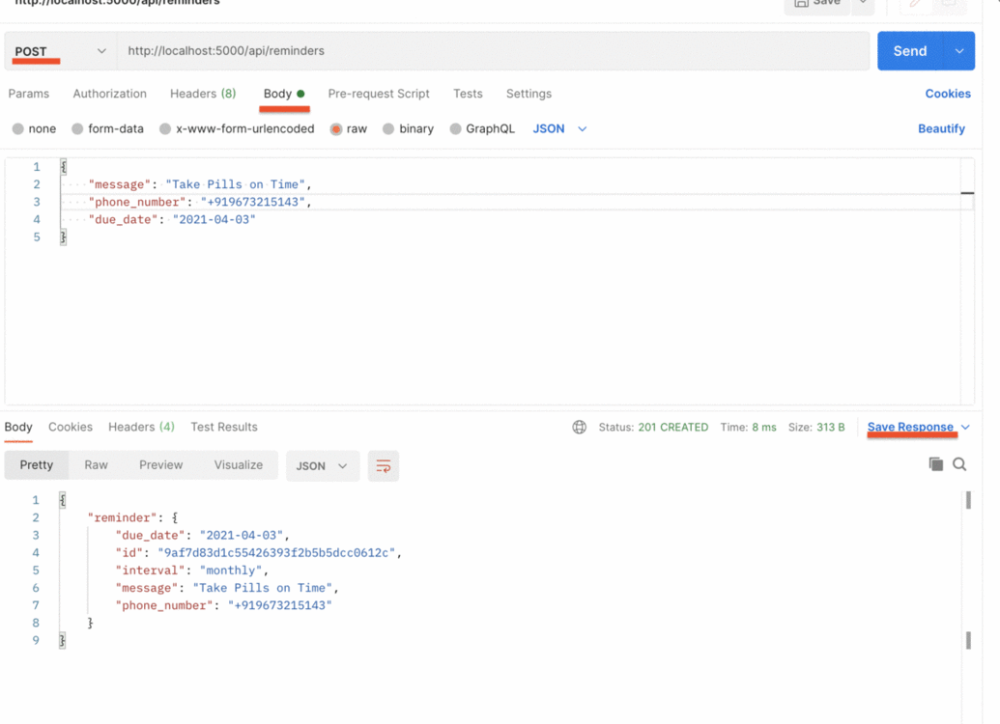

# DailyReminder 

This repo contains sms reminder service for alzheimer patients using python and Twilo. The basic idea behind this is to help them remember their doctor's appointments, pill time daily. Also have implemented schedule task using pythonAnywhere for sending reminders.

# Used :
- Python
- Flask
- Twilo
- postman
- pythonAnywhere

# screenshot of the application :

## Reference :
https://www.twilio.com/blog/build-sms-reminder-service-python-twilio

